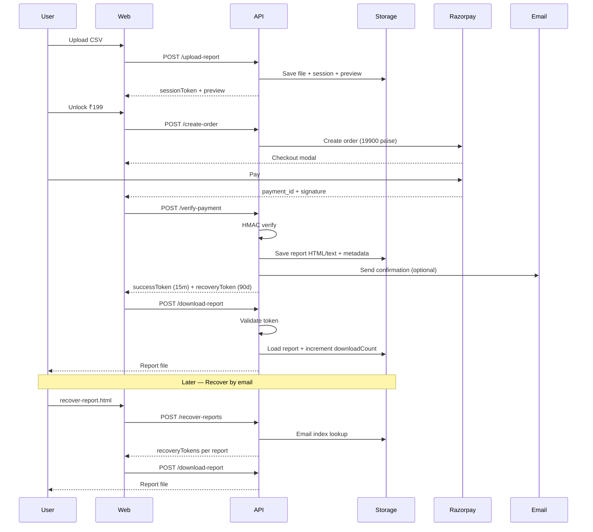

# Architecture — v17.1 Production Hardening

## System overview

```mermaid
flowchart TB
  subgraph Client
    P[pricing.html]
    S[starter-success.html]
    R[recover-report.html]
  end

  subgraph APIs
    U[/api/upload-report]
    GP[/api/generate-preview]
    CO[/api/create-order]
    VP[/api/verify-payment]
    DR[/api/download-report]
    RR[/api/recover-reports]
  end

  subgraph Core
    ST[storage.js]
    TK[tokens.js]
    RL[rate-limit.js]
    AU[audit.js]
    EM[email.js]
    RE[report-engine.js]
  end

  subgraph External
    RZ[Razorpay]
    BL[(Vercel Blob / S3)]
    ZO[Zoho SMTP]
  end

  P --> U --> ST --> BL
  P --> GP --> ST
  P --> CO --> RZ
  P --> VP --> RZ
  VP --> RE --> ST
  VP --> EM --> ZO
  S --> VP
  S --> DR --> ST
  R --> RR --> ST
  R --> DR

  U --> RL
  CO --> RL
  VP --> RL
  DR --> RL
  RR --> RL

  VP --> AU --> ST
  DR --> AU
  RR --> AU

  VP --> TK
  DR --> TK
  RR --> TK
```

## Data flow



## Storage layout (Blob/S3)

```
uploads/{sessionId}/{filename}     — original upload
sessions/{sessionId}.json          — session + analysis + preview
reports/{orderId}.json             — payment metadata + audit fields
reports/{orderId}/report.html      — generated HTML report
reports/{orderId}/report.txt       — generated text report
indexes/email/{hash}.json          — orderId list per email (HMAC keyed)
audit/{orderId}.json               — payment/download/email events
ratelimit/{scope}/{hash}.json      — rate limit counters
```

## Token model

| Token | TTL | Issued when | Used for |
|-------|-----|-------------|----------|
| Session | 2 hours | After upload | Preview, checkout |
| Success | 15 minutes | After payment verify | Success page download |
| Recovery | 90 days | After payment verify / recover lookup | Email recovery download |

All tokens are HMAC-SHA256 signed with `RAZORPAY_KEY_SECRET`.

## Fail-closed rules

- No Blob/S3 → 503 on all storage APIs
- Invalid/expired token → 403 on download
- Unverified payment → no report record, no recovery token
- Email failure → payment and download still succeed
