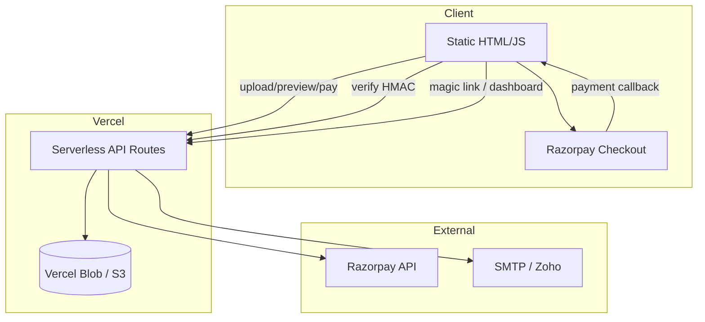

# Architecture — v18.0 Commercial Launch

**Date:** 2026-06-27

## System overview



## Core journeys

### 1. Starter Report (anonymous → paid)

```
pricing.html → upload-report → generate-preview → create-order
  → Razorpay → verify-payment → download-report → email
```

### 2. Account access (returning customer)

```
login.html → auth-magic-link → email → auth-verify → dashboard.html
  → dashboard API → download-report / invoice
```

### 3. Admin operations

```
admin.html → admin-search / admin-analytics / admin-actions
  (Bearer ADMIN_API_KEY)
```

## Storage layout (Blob/S3)

```
uploads/{sessionId}/{filename}
sessions/{sessionId}.json
reports/{orderId}.json
reports/{orderId}.html
reports/{orderId}.txt
indexes/email/{hash}.json
indexes/payment/{paymentId}.json
indexes/session-order/{sessionId}.json
audit/{orderId}.json
analytics/daily/{YYYY-MM-DD}.json
auth/magic/{hash}.json
auth/sessions/{sessionId}.json
ratelimit/{scope}/{hash}.json
```

## Security layers

| Layer | Mechanism |
|-------|-----------|
| Payment | Razorpay HMAC-SHA256 server verification |
| Download | Signed success token (15 min) or recovery token (90 days) |
| Session upload | HMAC session token bound to content hash |
| Auth | Magic link + HttpOnly session cookie |
| Admin | Bearer API key |
| Transport | HTTPS + HSTS |
| Abuse | Per-IP and per-email rate limits |

## API surface (v18.0)

| Category | Routes |
|----------|--------|
| Checkout | upload-report, generate-preview, create-order, verify-payment, download-report |
| Recovery | recover-reports |
| Auth | auth-magic-link, auth-verify, auth-session, auth-logout |
| Customer | dashboard, invoice |
| Admin | admin-search, admin-analytics, admin-actions |
| Platform | health, pricing, analytics-track |

## Token model

| Token | TTL | Purpose |
|-------|-----|---------|
| Session | 2 hours | Upload/preview/checkout binding |
| Success | 15 minutes | Post-payment immediate download |
| Recovery | 90 days | Email recovery + dashboard download |
| Magic link | 15 minutes | Passwordless sign-in |
| Auth session | 30 days | Dashboard cookie |

## Dependencies

- `@vercel/blob` — primary persistence
- `@aws-sdk/client-s3` — S3 fallback
- `nodemailer` — email delivery

## Unchanged constraints

- Checkout amount: **19900 paise INR**
- No `/tmp` or ephemeral storage
- Fail closed on missing configuration
