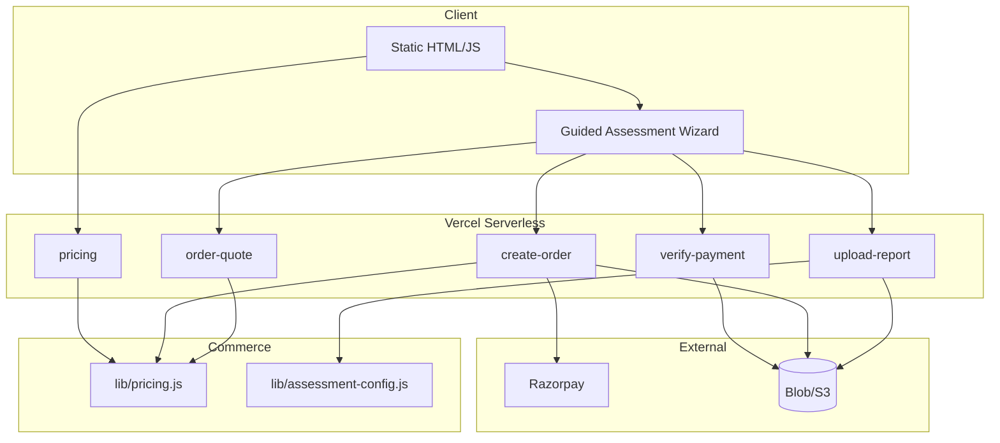

# Architecture — v21.0 Commercial SaaS



## Plan detection flow

```
workItems + projectCount + fileSize
  → detectPlanTier()
  → planRecommendationReason()
  → selfServe? → order-quote → create-order : enterprise gate
```

## Pricing flow

```
planId + currency
  → getPlanBasePriceMinor()
  → + convenienceFee + tax - discount
  → totalMinor → Razorpay order amount
```

## Security boundary

- All amounts computed in `api/lib/pricing.js`
- Client displays quote from API only
- `orderConfirmed` required for create-order
- HMAC verification unchanged

## Version history

- v17.1: Persistent storage
- v18.0: Accounts, dashboard, admin
- v19.0: Guided assessment wizard
- v21.0: Multi-tier commercial SaaS pricing
